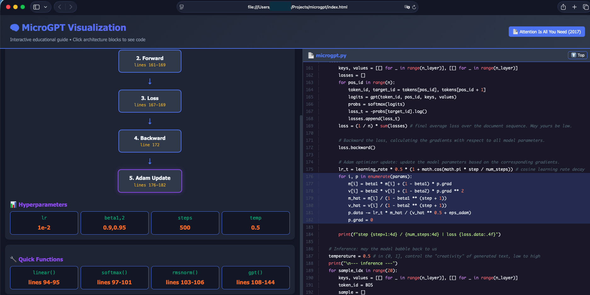

# MicroGPT - Interactive Educational Visualization

> **An interactive educational tool to help understand Andrej Karpathy's [`microgpt.py`](microgpt.py) implementation** - the most atomic way to train and inference a GPT in pure Python.

This visualization demonstrates the core Transformer architecture from seminal paper ["Attention Is All You Need"](https://arxiv.org/abs/1706.03762) (Vaswani et al., 2017) with direct references to the actual Python code.
## Usage

Simply open [`index.html`](index.html) in your browser:

```bash
open index.html
# or
python -m http.server 8000
# Then visit http://localhost:8000
```
## Screenshot



---

## Features

- **Split-pane layout**: Interactive visualization on the left, full Python source code on the right
- **Click-to-highlight**: Click any architecture block, parameter, or training step to jump to the corresponding code
- **Python syntax highlighting**: Full syntax highlighting with line numbers
- **Architecture tabs**:
  - 🏗️ Architecture - Model structure with animated forward pass
  - 🔄 Autograd - The Value class with computation graph
  - 👁️ Attention - Multi-head attention visualization
  - 🏋️ Training - Complete training loop breakdown
- **Interactive elements**: Animated forward pass, attention heatmaps, parameter cards

---

## MicroGPT Implementation by @karpathy

The [`microgpt.py`](microgpt.py) file contains a complete GPT implementation in **pure Python with zero external dependencies** - no PyTorch, no TensorFlow, no NumPy.

### Key Components

| Component | Description | Lines |
|------------|-------------|--------|
| **Value class** | Custom autograd engine with backward() | 30-72 |
| **Tokenizer** | Character-level tokenization with BOS token | 14-27 |
| **Embeddings** | Token (wte) and position (wpe) embeddings | 74-86, 109-111 |
| **Multi-head attention** | Query, Key, Value projections with softmax | 118-133 |
| **MLP** | Feed-forward with ReLU² activation | 136-141 |
| **RMSNorm** | Root mean square normalization | 103-106 |
| **Adam optimizer** | Adam with cosine learning rate decay | 176-182 |

### Model Architecture

```
Input → Embeddings (wte + wpe) → Pre-Norm
    → Multi-Head Attention (Q, K, V, O) + Residual
    → Pre-Norm → MLP (fc1 → ReLU² → fc2) + Residual
    → Output (lm_head) → Logits
```

### Parameters

| Parameter | Shape | Description |
|-----------|--------|-------------|
| `n_embd` | 16 | Embedding dimension |
| `n_head` | 4 | Number of attention heads |
| `n_layer` | 1 | Number of transformer layers |
| `block_size` | 8 | Maximum sequence length |
| `vocab_size` | 27 | Character vocabulary size |
| `learning_rate` | 1e-2 | Adam learning rate |
| `num_steps` | 500 | Training iterations |

### Training

The model is trained on a names dataset to generate new name-like sequences:

1. **Tokenize**: `doc → [BOS] + tokens + [BOS]`
2. **Forward**: `gpt(token_id, pos_id, keys, values) → logits`
3. **Loss**: Cross-entropy `-log(probs[target_id])`
4. **Backward**: `loss.backward()` computes all gradients
5. **Adam**: Update parameters with momentum and adaptive learning rates

---

## Connection to "Attention Is All You Need" (2017)

| Paper Component | MicroGPT Variable | Notes |
|----------------|-------------------|-------|
| d_model | `n_embd` = 16 | Paper uses 512 |
| h (heads) | `n_head` = 4 | Paper uses 8 |
| d_k = d_v = d_model/h | `head_dim` = 4 | 16 / 4 = 4 |
| d_ff | 4 × `n_embd` = 64 | Paper uses 4×d_model |
| LayerNorm | `rmsnorm()` | Simplified, no bias |
| Activation | `relu()²` | Paper uses ReLU |
| N (layers) | `n_layer` = 1 | Paper uses 6 |

### Key Differences from Paper

- **Pre-LN vs Post-LN**: MicroGPT uses pre-layer norm (like GPT-2), paper uses post-layer norm
- **Decoder-only**: MicroGPT is GPT-style decoder (causal mask), paper has encoder-decoder
- **No biases**: Simplified implementation, all linear layers are bias-free
- **Activation**: ReLU² approximates squared ReLU (similar to GeLU's shape)
- **Scale**: Educational scale (tiny model) vs production scale

---


### Interactive Features

- **Click architecture blocks** to jump to corresponding code
- **Click parameter cards** to see their definitions
- **Use "Animate Forward"** to watch data flow through the model
- **Hover over attention cells** for detailed weight information

---

## Credits

- **Original implementation**: [@karpathy](https://github.com/karpathy) - MicroGPT
- **Paper**: ["Attention Is All You Need"](https://arxiv.org/abs/1706.03762) (Vaswani et al., 2017)
- **Built with**: Pure HTML, CSS, and JavaScript - no external dependencies

## License

This is an educational visualization. The original microgpt.py implementation by Andrej Karpathy is provided for educational purposes.
